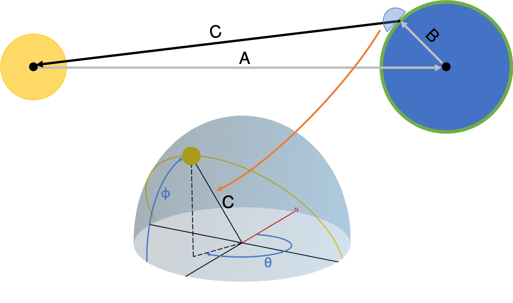

# sun_coordinates
Get the spherical coordinates of the sun in the sky from any location on earth at any time

## Quick Summary
The sun.py script can take in any location in the world, and any time, and output the spherical coordinates of the sun from the perpective of a person standing on the earth's surface at that location. This is done using vector addition and coordinate transformations (elaborated on later).

The location of the sun is given by two angles:
* Theta_from_North - angle measured clockwise from due north to the point on the horizon underneath the sun
* Phi_from_Horizon: - angle from the horizon up to the sun

A 3D visualization using Matplotlib of the sun's location in the sky is also outputted by the model:

## How to run the code
The code takes three inputs: time, location, and save figure boolean

These inputs can be given in the command line, or by modifying the get_inputs(args) method within the script directly.

Command Line Instructions:
* -d: Date and time string of form 'YYYY-MM-DD HH:MM:SS'
* -c: String containing the city. This input is relatively versatile since multiple city structures are accepted (for example: San Francisco or San Francisco, CA)
* -p: Write True if you want a png image of the 3D visualization to be stored locally with the title 'out.png'

## Math behind calculations

The key calculation is getting the vector that points from the person on the surface of the earth, to the sun (Vector C in the figure below). 

This can be calculated simply by adding two vectors: a vector pointing from the center of the sun to the center of the earth (Vector A) and a vector pointing from the center of the earth to the surface of the sun (Vector B).

_**A**_ + _**B**_ = -_**C**_ 

The tricky part of this math is the reference frame (ie coordinate system) of the vectors. Ultimately, we want vector C in the reference frame of a person standing on the surface of the earth. In other words, the origin should be at the person's feet, with x pointing east, y pointing north, and z pointing straight up. The reason we want this is that Theta_from_North and Phi_from_Horizon pop out super easily from those x, y, and z coordinates. Unfortunately, representing vectors _**A**_ and _**B**_ in the earth's surface coordinate system is difficult. However, _**A**_ and _**B**_ can be represented easily in different coordinate systems: _**A**_ can be represented easily in a coordinate system with the origin at the sun, and _**B**_ can be represented easily with an origin at the center of the earth.

To reconcile this challenge, the key is to use coordinate transformations! The basic idea here is that we start with a vector in one coordinate system, transform it to the coordinate system of the vector we want to add it to, and then add that vector without too much trouble since the 2nd vector can be represented easily in the new coordinate system. The workflow is broken down as follows:

1. Write vector _**A**_, which goes from the center of the sun to the center of the earth, in the sun's coordinate system (origin at center of the sun).
2. Transform _**A**_ to the coordinate system of the earth (origin is at the center of the earth)
3. Write vector _**B**_, which goes from the center of the earth to the earth's surface, in earth's coordinate system.
4. Add _**A**_(transformed) and _**B**_ to get _**C**_, which is the vector we ultimately want, but is currently in the wrong coordinate system.
5. Transform _**C**_ into the coordinate system of the earth's surface (origin centered at a person's feet on the surface)